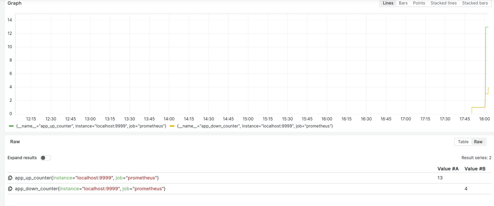

# Setup Prometheus and Grafana on your project

This repository shows how you can setup prometheus and grafana on your project and visualize the stats via a basic counter application.

---

## Prerequisities

1. prometheus
2. grafana

## Description

The file `main.go` defines a simple web service that manages a counter with increment and decrement operations. It also incorporates Prometheus metrics to monitor the count operations. Here's a brief description of the code:

- The program starts an HTTP server on port 9999.

- Two HTTP endpoints /up and /down are defined to increment and decrement the count variable, respectively.

- A mutex (countLock) is used to ensure safe concurrent access to the count variable to prevent race conditions.

- Prometheus metrics are implemented with two counters, increaseCounter and decreaseCounter, which track the number of times the count is increased and decreased, respectively. These metrics are registered with Prometheus.

- The /metrics endpoint is provided to expose Prometheus metrics.

- When the /up endpoint is hit, the count is increased, and the increaseCounter metric is incremented.

- When the /down endpoint is hit, the count is decreased if it's greater than zero, and the decreaseCounter metric is incremented. If the count is already zero or negative, it returns a BadRequest HTTP response.

- Log messages are printed to the console for each count increment and decrement.

Overall, this code creates a simple Go web service with Prometheus metrics to track count operations, ensuring that the count is incremented and decremented safely with concurrency handling.

---

## Now comes prometheus and grafana

- Create a file [`prometheus.yaml`](./prometheus/prometheus.yml) and set the target to `localhost:9999`, where our http server is running.

- By default, prometheus server runs at port 9090. You can start prometheus server using command 
    ```shell
    prometheus --config.file=./prometheus/prometheus.yml  
    ```
- Run grafana server
    ```shell
    sudo systemctl enable grafana
    sudo systemctl start grafana
    ```
- Now, you can access grafana at port 3000 in your browser. Enter the following url in your web browser
    `http://127.0.0.1:3000/`
- Enter your credentials. default username and password both are admin
- Now, add prometheus data source:
    - Click on ☰ on the left
    - Select Data Sources under conections.
    
    - Click on Add Data Source
    - Select Prometheus
    - Update server url to `http://localhost:9090/`
    
    - Scroll down, and select Save & Test<br>
    
    - Now, you are ready to visualize the data.

- Run the program with
```shell
go run main.go
```

- On another terminal, use the following command to increase or decrease the counter
```shell
curl -X POST http://localhost:9999/up
curl -X POST http://localhost:9999/down
```

- The number of times you called up and down are being tracked in prometheus. To visualize this, you can click `Explore View` in the image above

Under metric, select app_up_counter in dropdown.
Add query, and select app_down_counter here and click on execute query on the right


Then, you can see a graph which shows how many times the up and down counters were called. There's a text description under there.



You can export it to dashboard and view from there too. 
This is how you can start tracking metrices using grafana and prometheus.